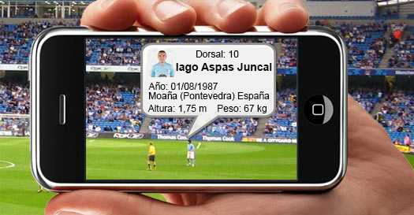

# Web Scraping de fútbol español
UOC/Tipología y ciclo de vida de los datos: Práctica 1. Web Scraping

## Breve descripción

El conjunto de datos resultante de este proyecto práctico recopia, en una misma fuente de datos, la información referente a los jugadores de futbol profesional español de primera y segunda división masculino. Agrupa datos de los jugadores como nombre, edad, fecha de nacimiento, etc, y los relaciona con sus respectivos equipos y liga.

## Archivos del código y ejecución

El proyecto se ha realizado Python:

- **main.py**:        Fichero principal de la aplicación 
- **Liga.py**:        Obtiene información de cada liga y las urls de los equipos que la componen
- **Equipo.py**:      Obtiene información de cada equipo y las urls de los jugadores que la componen
- **Jugador.py**:     Obtiene información de cada jugador, como por ejemplo: su nombre, aña de naciemiento, imagen, etc.
- **PetitionWeb.py**: Realiza el proceso de peticiones web mediante una url y controla el tiempo entre solicitudes.
- **EscritorCSV.py**: Encargado de almacenar la información obtenida en un dataset (.csv)

Para lanzar el proceso, se ejecutaría el fichero main.py. No pide información al usuario. Directamente comienza el proceso de recopilación de información y creación de un data set. Al concluir, se muestra por consola un mensaje informando de la finalización.
Durante la ejecución, se muestran las url que se van consultando y los tiempos de espera antes de cada solicitud, para evitar saturación del servidor y posibles bloqueos sobre nuestra IP.

## Librerías necesarias (algunas incluidas en la instalación de Python)

- **os**
- **urllib**
- **bs4**
- **requests**
- **csv**
- **time**
- **random**
- **pathlib**

## Miembros del equipo

Este proyecto ha sido realizado por: Javier Martínez

## Bibliografía

- Subirats, L., Calvo, M., (2018). Web Scraping. Editorial UOC
- Masip Rodo, D. El LenguajePython . Editorial UOC
- Lawson, R.(2015). Web Scraping with Python (2015)
